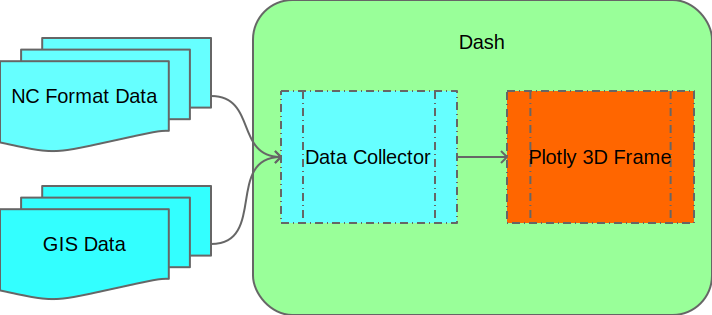

# Brandish

Brandish is a Web-based application to display 3D geometry data.

## How to start Brandish?

```bash
pip install -r requirements.txt
python final_generator.py
```

## How to generate Brandish data?

1. Download data from `resources/fulldata_url.txt`
2. (Optional) Create python virtual environment.
3. Execute:
    ```bash
    pip install -r requirements.txt
    python nc_file_parser.py
    ```

## Brandish Framwork



## Working Process
- [x] Netcdf format parsing
- [x] GIS format parsing
- [x] Json file generating
- [x] Plotly show 3D scalar field
- [ ] Plotly show 3D vector field (flow field)
- [ ] Deploy on server